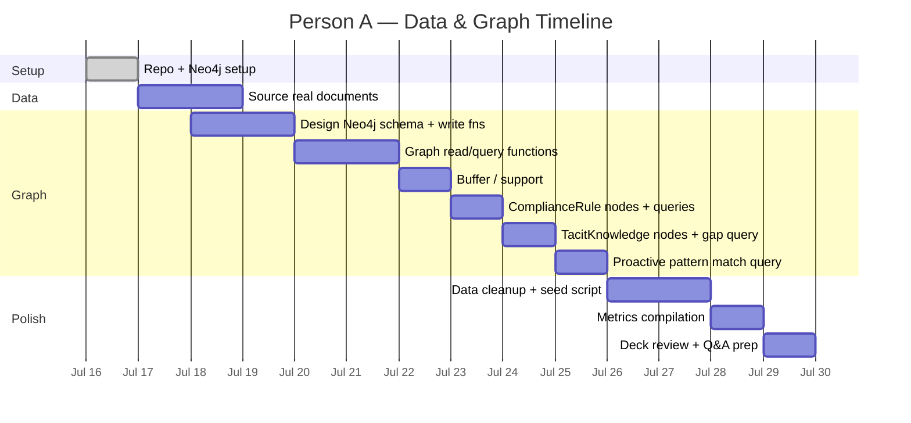

# Person A — Data & Graph: Complete Workflow

**Role:** Owns the data corpus, Neo4j graph database, entity extraction schema, and graph queries.  
**Core responsibility:** Everything that goes *into* and *out of* the knowledge graph — sourcing data, designing the schema, writing the graph layer, and supporting evaluation.

---

## Phase 0 — Setup (Half Day)

### Tasks
- [ ] Create the project repo and scaffold the full folder structure:
  ```
  project-root/
  ├── backend/
  │   ├── app/
  │   │   ├── main.py
  │   │   ├── routers/ (ingest, query, compliance, interview, alerts)
  │   │   ├── services/ (extraction, retrieval, confidence, compliance_engine, pattern_match)
  │   │   ├── models/
  │   │   ├── graph/
  │   │   └── prompts/
  │   └── requirements.txt
  ├── frontend/
  ├── data/
  │   ├── raw/
  │   ├── synthetic/
  │   └── eval/
  └── docs/
      ├── architecture.md
      └── known_limitations.md
  ```
- [ ] Set up **Neo4j AuraDB** (free tier) instance
- [ ] Get connection credentials (URI, username, password)
- [ ] Share `.env.example` with the team containing all required env vars

### Deliverables
- Repo is live, team has access
- Neo4j instance is reachable
- `.env.example` shared

### Dependencies
- **Wait for:** Nothing — you kick things off
- **Unblocks:** Person B (needs repo + env vars), Person C (needs repo for frontend scaffold)

### Technical Notes
> Neo4j AuraDB free tier gives you one database with limited storage — more than enough for a demo. Go to [aura.neo4j.io](https://aura.neo4j.io) → create a free instance → save the auto-generated password immediately (it's only shown once).

---

## Phase 1 — Data Corpus (Day 1–2)

### Tasks
- [ ] Source **1 real CRAC/chiller piping diagram** (search vendor sites: Vertiv, Schneider Electric, Stulz)
- [ ] Source **1 real OEM manual excerpt** for a CRAC unit
- [ ] Source **real ASHRAE TC9.9 thermal guideline text** (public excerpts)
- [ ] Organize all sourced documents into `/data/raw/`

### Deliverables
- `/data/raw/` contains at least 3 real documents:
  - A piping/cooling loop diagram (PDF or image)
  - An OEM manual excerpt (PDF or text)
  - ASHRAE TC9.9 guidelines (text)

### Dependencies
- **Wait for:** Nothing
- **Unblocks:** Phase 2 (ingestion needs real docs to process)

### Technical Notes
> **Where to find real documents:**
> - **Vertiv** (formerly Liebert): search "Vertiv CRAC unit installation manual PDF" — their Liebert CRV/DS series manuals are often publicly available
> - **Schneider Electric / APC**: search "APC InRow cooling unit manual PDF"
> - **Stulz**: search "Stulz CyberAir manual PDF"
> - **ASHRAE TC9.9**: the 2021 "Thermal Guidelines for Data Processing Environments" whitepaper has publicly cited excerpts; the full document is paywalled, but summary tables are widely reproduced in vendor docs

---

## Phase 2 — Ingestion + Extraction (Day 2–3)

### Tasks
- [ ] Design the **Neo4j schema** — define node types and relationship types:
  ```
  Nodes: Equipment, FailureMode, Incident, WorkOrder, 
         ComplianceRule, Technician, TacitKnowledge

  Relationships:
  (Equipment)-[:HAS_FAILURE_MODE]->(FailureMode)
  (Incident)-[:INVOLVES]->(Equipment)
  (Incident)-[:MATCHES_PATTERN]->(FailureMode)
  (WorkOrder)-[:RESOLVED_BY]->(Technician)
  (WorkOrder)-[:ADDRESSES]->(Incident)
  (Equipment)-[:GOVERNED_BY]->(ComplianceRule)
  (TacitKnowledge)-[:ABOUT]->(Equipment)
  (TacitKnowledge)-[:CONTRIBUTED_BY]->(Technician)
  ```
- [ ] Write **Neo4j write functions** (Python, using the `neo4j` driver):
  - `create_equipment(name, type, location, ...)`
  - `create_failure_mode(name, description, ...)`
  - `create_incident(date, description, severity, ...)`
  - `link_incident_to_equipment(incident_id, equipment_id)`
  - `link_incident_to_failure_mode(incident_id, failure_mode_id)`
  - etc.
- [ ] Test the schema manually by inserting a handful of sample entities and verifying relationships in the Neo4j browser

### Deliverables
- `backend/app/graph/` contains:
  - `driver.py` — Neo4j connection setup
  - `schema.py` — Cypher queries for creating constraints/indexes
  - `write.py` — All write functions
- Manual test confirms nodes + relationships are visible in Neo4j browser

### Dependencies
- **Wait for:** Person B's extraction output format (coordinate on the JSON structure Claude returns so your write functions accept the right shape)
- **Unblocks:** Person B (needs your write functions to wire extraction → Neo4j)

### Technical Notes
> **Recommended Python driver:** `neo4j` (official driver). Install via `pip install neo4j`.
> ```python
> from neo4j import GraphDatabase
> 
> driver = GraphDatabase.driver(NEO4J_URI, auth=(NEO4J_USER, NEO4J_PASSWORD))
> 
> def create_equipment(tx, name, eq_type, location):
>     tx.run(
>         "CREATE (e:Equipment {name: $name, type: $type, location: $location})",
>         name=name, type=eq_type, location=location
>     )
> ```
> Keep the schema deliberately small — 5–7 node types is enough for the demo.

---

## Phase 3 — RAG Copilot (Day 3–4)

### Tasks
- [ ] Write **Neo4j read/query functions** to fetch related facts for a given question or equipment:
  - `get_equipment_history(equipment_name)` — all incidents, work orders, failure modes linked to an equipment node
  - `get_related_failures(equipment_name)` — past failure modes and their resolutions
  - `get_equipment_context(equipment_name)` — full subgraph around an equipment node (for RAG context enrichment)
- [ ] **Support Person B** by tuning graph queries for retrieval relevance — adjust what gets returned based on what produces good RAG answers

### Deliverables
- `backend/app/graph/read.py` — All read/query functions
- Graph queries return well-structured data that Person B can merge with pgvector results for RAG context

### Dependencies
- **Wait for:** Person B to define what context shape they need for the RAG prompt
- **Unblocks:** Person B (needs graph facts to combine with vector search for RAG answers)

### Technical Notes
> The key graph query pattern for RAG is: given an equipment name mentioned in the user's question, traverse 1–2 hops to find all related incidents, failure modes, and work orders. Return them as a flat list of facts that can be injected into the Claude prompt alongside the pgvector chunks.
> ```cypher
> MATCH (e:Equipment {name: $name})-[r]-(related)
> RETURN type(r) AS relationship, labels(related) AS type, properties(related) AS data
> ```

---

## Phase 4 — Confidence Tiering (Day 4, Half Day)

### Tasks
- [ ] No graph changes needed
- [ ] **Support Person B and Person C** if they are blocked on anything

### Deliverables
- None specific — this is a support/buffer phase for you

### What to Do With Free Time
- Clean up graph data for the hero demo scenario
- Add indexes to Neo4j for frequently queried properties (`Equipment.name`, `Incident.date`)
- Write helper scripts to seed/reset demo data quickly

---

## Phase 5 — Compliance Engine (Day 5)

### Tasks
- [ ] Add **`ComplianceRule` nodes** to Neo4j and link them to equipment types:
  ```cypher
  CREATE (r:ComplianceRule {
    clause_ref: "ASHRAE-TC9.9-4.1",
    description: "Coil cleaning interval",
    requirement: "CRAC unit coils must be cleaned every 90 days",
    interval_days: 90
  })
  
  MATCH (e:Equipment {type: "CRAC"}), (r:ComplianceRule {clause_ref: "ASHRAE-TC9.9-4.1"})
  CREATE (e)-[:GOVERNED_BY]->(r)
  ```
- [ ] Write a query to **fetch equipment's current maintenance state** — when was it last cleaned/inspected:
  ```cypher
  MATCH (e:Equipment {name: $name})<-[:ADDRESSES]-(wo:WorkOrder)
  WHERE wo.type = "preventive_maintenance"
  RETURN wo.completed_date AS last_maintained
  ORDER BY wo.completed_date DESC
  LIMIT 1
  ```

### Deliverables
- `ComplianceRule` nodes exist in Neo4j, linked to equipment
- Query functions added to `backend/app/graph/read.py`:
  - `get_compliance_rules_for_equipment(equipment_name)`
  - `get_last_maintenance_date(equipment_name, maintenance_type)`

### Dependencies
- **Wait for:** Nothing
- **Unblocks:** Person B (needs these queries to build the `/compliance` endpoint)

---

## Phase 6 — Tacit Knowledge Capture (Day 6)

### Tasks
- [ ] Add **`TacitKnowledge` node type** to the graph, linked to `Equipment` and `Technician`:
  ```cypher
  CREATE (tk:TacitKnowledge {
    question: $question,
    answer: $answer,
    captured_at: datetime(),
    equipment_context: $equipment_name
  })
  
  MATCH (e:Equipment {name: $equipment_name}), (tk:TacitKnowledge {captured_at: $timestamp})
  CREATE (tk)-[:ABOUT]->(e)
  
  MATCH (t:Technician {name: $technician_name}), (tk:TacitKnowledge {captured_at: $timestamp})
  CREATE (tk)-[:CONTRIBUTED_BY]->(t)
  ```
- [ ] Write a function to **check what's already documented** for a piece of equipment (to identify knowledge gaps for the interview):
  ```cypher
  MATCH (e:Equipment {name: $name})-[r]-(related)
  WITH e, collect(DISTINCT type(r)) AS documented_relationships,
       collect(DISTINCT labels(related)) AS documented_types
  RETURN e.name, documented_relationships, documented_types
  ```

### Deliverables
- `TacitKnowledge` write functions in `backend/app/graph/write.py`
- Gap-detection query in `backend/app/graph/read.py`

### Dependencies
- **Wait for:** Nothing
- **Unblocks:** Person B (needs write functions + gap query for `/interview` endpoint)

---

## Phase 7 — Proactive Push (Day 6–7)

### Tasks
- [ ] Write a **graph query to check a new incident/ticket against existing patterns**:
  ```cypher
  // Given a new incident's equipment and symptoms, find past matches
  MATCH (e:Equipment {name: $equipment_name})<-[:INVOLVES]-(past:Incident)-[:MATCHES_PATTERN]->(fm:FailureMode)
  WHERE fm.description CONTAINS $symptom_keyword
  RETURN past, fm, 
         past.resolution AS past_resolution,
         past.date AS when_it_happened
  ORDER BY past.date DESC
  ```

### Deliverables
- Pattern-matching query function in `backend/app/graph/read.py`:
  - `find_matching_past_incidents(equipment_name, symptom_keywords)`

### Dependencies
- **Wait for:** Nothing
- **Unblocks:** Person B (needs this query for the proactive pattern-match service)

---

## Phase 8 — Frontend Polish (Day 7–8)

### Tasks
- [ ] **Support data cleanup** — make sure the hero scenario data is complete and consistent across all views:
  - CRAC-3 has incidents, work orders, compliance rules, and tacit knowledge all linked correctly
  - The demo flow (new ticket → alert → RAG answer → compliance gap → tacit knowledge citation) works with real data in the graph
- [ ] Seed script that can reset the graph to a clean demo state quickly

### Deliverables
- Hero scenario data is verified end-to-end in Neo4j
- `scripts/seed_demo_data.py` — one-command reset to demo-ready state

---

## Phase 9 — Evaluation (Day 8–9)

### Tasks
- [ ] Help compile **final metrics into a clean summary**:
  - Entity extraction accuracy (precision/recall against ground-truth labels)
  - RAG answer accuracy (against Q&A eval set)
  - Graph statistics: number of nodes, relationships, node types
  - Compliance rules checked, gaps found

### Deliverables
- Metrics summary table ready for the deck:
  | Metric | Value |
  |--------|-------|
  | Entities extracted | X / Y correct |
  | RAG Q&A accuracy | X / Y correct |
  | Graph nodes | N |
  | Graph relationships | M |
  | Compliance rules | K |

---

## Phase 10 — Deck, Diagram, Demo Video (Day 9–10)

### Tasks
- [ ] **Review technical accuracy** of the architecture diagram and deck's technical slides
- [ ] Ensure the graph portion of the architecture diagram correctly shows:
  - Node types and their relationships
  - How graph data flows into RAG and compliance features
- [ ] Prepare to answer judge questions about graph design decisions (why Neo4j, why this schema shape, why not just vector search alone)

### Deliverables
- Architecture diagram reviewed and approved
- Talking points ready for technical Q&A

---

## Timeline View



---

## Key Coordination Points with Team

| When | Coordinate With | About |
|------|----------------|-------|
| Phase 0 | B & C | Share `.env.example`, confirm repo access |
| Phase 2 | **Person B** | Agree on extraction JSON format so write functions match |
| Phase 3 | **Person B** | Agree on what graph context shape the RAG prompt needs |
| Phase 5 | **Person B** | Hand off compliance queries for the `/compliance` endpoint |
| Phase 6 | **Person B** | Hand off tacit knowledge write functions + gap query |
| Phase 7 | **Person B** | Hand off pattern-match query for proactive push |
| Phase 8 | **Person C** | Verify demo data renders correctly in all 4 frontend views |

---

## Quick Reference — All Files Person A Owns

```
backend/app/graph/
├── driver.py          # Neo4j connection setup
├── schema.py          # Constraints, indexes, schema initialization
├── write.py           # All create/update functions for graph nodes & relationships
└── read.py            # All query functions (equipment history, compliance, patterns, gaps)

data/
├── raw/               # Sourced real documents
│   ├── crac_piping_diagram.pdf
│   ├── oem_manual_excerpt.pdf
│   └── ashrae_tc9.9_guidelines.txt

scripts/
└── seed_demo_data.py  # Reset graph to demo-ready state
```
